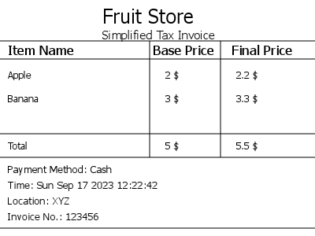

# Ez Invoice
- A Simple Invoice Generator for starters

# How to use
- Creating an Invoice
  
```js
const { createInvoice } = require("ez-invoice")
const { createWriteStream } = require("fs")

const options = {
    storeName: "Fruit Store",
    tax: 10,
    currency: "$",
    paymentMode: "Cash",
    location: "XYZ",
    invoiceID: "123456"
}

let items = [
    {
        name: "Apple",
        beforeTax: 2
    },
    {
        name: "Banana",
        beforeTax: 3
    },
]

const invoice = createInvoice(options, items)
invoice.png.pipe(createWriteStream("./invoice.png"))
//or
invoice.jpeg.pipe(createWriteStream("./invoice.jpeg"))
```
